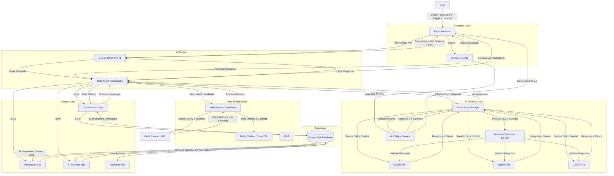

# AI Consensus 🤖✨

**Get informed answers by comparing responses from multiple AI services simultaneously**

## Why AI Consensus?

In today's AI-driven world, different AI models often provide varying perspectives on the same question. **AI Consensus** solves the problem of AI response uncertainty by letting you:

- **Compare multiple AI perspectives** side-by-side
- **Make informed decisions** based on consensus across leading AI services
- **Identify the most comprehensive answer** for your specific needs
- **Save time** by querying multiple AIs in parallel instead of switching between platforms

## The Problem This App Solves

### Before: The AI Shopping Problem
- 🔄 **Switching between platforms**: Multiple AI services separately  
- ❓ **Uncertain which AI gives the best answer** for your question
- ⏱️ **Time-consuming** to get multiple perspectives
- 🤔 **Hard to compare responses** when they're on different platforms

### After: AI Consensus Solution
- ⚡ **One query, multiple responses** - instantly compare responses from leading AI models
- 📊 **Side-by-side comparison** with AI-generated intelligent summaries and full details
- 🎯 **Choose the best response** and continue the conversation seamlessly  
- 🔧 **Advanced features** like structured summarization with each AI using its own intelligence

## Demo

**Sample Query**: "Which top three state-of-the-art LLMs are most frequently fine-tuned to support mission-critical business applications, with model weights either publicly accessible or available for licensing from leading frontier AI providers?"

### Clean Interface with Consistent Action Buttons


*Clean, modern interface with consistent action buttons: Expand/Collapse, Select for AI Critic, and Preferred This*

### Detailed Response View


*Expandable responses with full AI-generated content, structured markdown rendering, and action buttons*

### AI Critique & Comparison Feature


*Select multiple responses to get AI-powered comparative analysis and critique*

## Key Features

### 🚀 Core Functionality
- **Multi-AI Query**: Simultaneous responses from multiple leading AI models
- **AI-Generated Smart Summaries**: Each AI creates its own intelligent 35-45 word synopsis
- **Web Search Integration**: Optional real-time web search to enhance AI responses with up-to-date information
- **Response Selection**: Choose your preferred response and continue the conversation
- **Conversation Continuity**: Seamless chat experience with selected responses
- **Real-time Visual Feedback**: Blinking animation while AIs are thinking, hover tooltips showing model information

### 🧠 Advanced AI Features
- **AI-Generated Smart Summaries**: Each AI creates its own intelligent 35-45 word synopsis
- **AI Critique & Comparison**: Select any two responses for detailed AI-powered comparative analysis
- **Structured Summaries**: Advanced structured summarization across all AI providers
- **Enhanced API Endpoints**: `/summary/structured/` and `/critique/compare/` for specialized tasks
- **Flexible Response Modes**: Standard chat or structured summary mode

### 🎨 UI/UX Improvements
- **Consistent Action Buttons**: Uniform styling across Expand/Collapse, Select for AI Critic, and Preferred This buttons
- **Intelligent Response Selection**: "Preferred This" removes all other responses including AI Critic for clean continuation
- **No Auto-Expansion**: Select for AI Critic doesn't automatically expand responses, giving users full control
- **Professional Button Design**: Consistent height, padding, and visual weight across all interactive elements

### 🌐 Web Search Features
- **Real-time Web Search**: Toggle-enabled Reka Research API integration for current information
- **Intelligent Search**: Reka handles up to 2 web searches per query automatically with smart optimization
- **Location-Aware Search**: Browser geolocation support for location-specific results
- **Rate Limiting**: Proper rate limiting per user for efficient resource usage
- **Caching Layer**: 15-minute Redis TTL for efficient search result caching
- **Source Display**: Collapsible web sources with clickable links (collapsed by default)
- **Context Enhancement**: Web search results seamlessly integrated into AI prompts

### 🛠️ Technical Features
- **REST API** backend with async AI service integration
- **Modern web frontend** with real-time updates
- **Modular AI Service Architecture** supporting easy addition of new AI providers
- **Comprehensive Error Handling** with fallback mechanisms
- **Authentication & Permissions** ready for multi-user deployment

## Architecture



### Architecture Components

#### Frontend Layer
- **React/TypeScript SPA**: Modern frontend with real-time updates
- **UI Components**: AIConsensusComplete, ConversationHistory, Sidebar, MarkdownRenderer
- **Features**: Expandable responses, AI critique selection, response preference, web source display

#### API Layer
- **Django REST API v1**: RESTful endpoints with versioning
- **Multi-Agent Orchestrator**: Coordinates parallel AI service calls and web search
- **Rate Limiting**: Per-user rate limiting for web searches
- **Context Management**: Conversation continuity and history tracking

#### Web Search Layer
- **Web Search Coordinator**: Intelligent search orchestration with location support
- **Reka Research API**: AI-powered web search with automatic optimization (max 2 searches per query)
- **Redis Cache**: 15-minute TTL for search results and deduplication

#### AI Services Layer
- **AI Services Manager**: Unified interface for Claude, OpenAI, and Gemini
- **Structured Summary Service**: Pydantic-based JSON schema validation
- **AI Critique Service**: Comparative analysis of multiple AI responses
- **Async Processing**: Parallel service calls for optimal performance

#### Django Apps
- **Accounts**: User authentication and management
- **Conversations**: Conversation sessions, messages, and context
- **Responses**: AI responses with token tracking and cost calculation
- **AI Services**: Service configuration, queries, and task management

#### Data Layer
- **PostgreSQL**: Primary database with conversation_cost_view for accurate pricing
- **Models**: Conversation, Message, AIQuery, AIResponse, AIService, ConversationContext
- **Indexing**: Optimized queries with strategic database indexes


## Setup and Installation

### Prerequisites

- Modern Python environment
- Current Node.js runtime
- Optional caching service (for production; app works without it)
- API Keys for supported AI services

### Backend Setup

1. **Clone and navigate to project**
   ```bash
   git clone <repository-url>
   cd chat-ai-app
   ```

2. **Create virtual environment**
   ```bash
   python3 -m venv venv
   source venv/bin/activate  # On Windows: venv\Scripts\activate
   ```

3. **Install dependencies**
   ```bash
   pip install --upgrade pip
   pip install -r requirements.txt
   ```

4. **Configure environment variables**
   ```bash
   cp .env.example .env
   ```

   Edit `.env` with your API keys:
   ```env
   # AI Service API Keys (get these from respective providers)
   OPENAI_API_KEY=sk-your-openai-key
   CLAUDE_API_KEY=sk-ant-your-claude-key
   GEMINI_API_KEY=your-gemini-key

   # Reka API Key (for web search functionality)
   REKA_API_KEY=your-reka-api-key

   # Google OAuth Configuration (see Google OAuth Setup section below)
   GOOGLE_OAUTH_CLIENT_ID=your-client-id.apps.googleusercontent.com
   GOOGLE_OAUTH_CLIENT_SECRET=your-client-secret
   FRONTEND_URL=http://localhost:3000

   # Django Configuration
   SECRET_KEY=your-secret-key-here
   DEBUG=True

   # Other settings are optional for basic setup
   ```

5. **Run database migrations**
   ```bash
   python3 manage.py migrate
   ```

6. **Load AI service data (required for cost tracking)**
   ```bash
   python3 manage.py loaddata apps/ai_services/fixtures/initial_services.json
   ```
   This creates the AI service records (Claude, OpenAI, Gemini) with pricing information.

7. **Create a superuser account (required for accessing the application)**
   ```bash
   python3 manage.py createsuperuser
   ```
   Follow the prompts to create your admin account.

8. **Start backend server**
   ```bash
   python3 manage.py runserver 8000
   ```

### Frontend Setup

1. **Navigate to frontend directory**
   ```bash
   cd frontend/frontend
   ```

2. **Install dependencies**
   ```bash
   npm install
   ```

   **Note**: The project includes modern dependencies like React 19, TailwindCSS 3.x with PostCSS plugin, and TypeScript.

3. **Start frontend development server**
   ```bash
   npm start
   ```

### Access the Application

- **Frontend**: http://localhost:3000
- **Backend API**: http://localhost:8001

## Google OAuth Setup

The application supports Google OAuth for seamless authentication. Follow these steps to configure Google OAuth:

### 1. Create a Google Cloud Project

1. Visit [Google Cloud Console](https://console.cloud.google.com/)
2. Create a new project or select an existing one
3. Navigate to **APIs & Services** → **Credentials**

### 2. Configure OAuth Consent Screen

1. Go to **OAuth consent screen** in the left sidebar
2. Select **External** user type (or Internal for Google Workspace)
3. Fill in required information:
   - **App name**: AI Consensus
   - **User support email**: Your email
   - **Developer contact email**: Your email
4. Add scopes: `email`, `profile`, `openid`
5. Add test users (your email) for development
6. Save and continue

### 3. Create OAuth 2.0 Client ID

1. Go to **Credentials** → **Create Credentials** → **OAuth client ID**
2. Select **Web application**
3. Configure settings:
   - **Name**: AI Consensus Web Client
   - **Authorized JavaScript origins**: `http://localhost:3000`
   - **Authorized redirect URIs**: `http://localhost:3000/auth/google/callback`
4. Click **Create**
5. Copy the **Client ID** and **Client Secret**

### 4. Update Environment Variables

Add the credentials to your `.env` file:

```env
GOOGLE_OAUTH_CLIENT_ID=your-client-id.apps.googleusercontent.com
GOOGLE_OAUTH_CLIENT_SECRET=your-client-secret
FRONTEND_URL=http://localhost:3000
```

Also create `frontend/frontend/.env`:

```env
REACT_APP_API_URL=http://localhost:8000
REACT_APP_GOOGLE_CLIENT_ID=your-client-id.apps.googleusercontent.com
```

### 5. Authentication Flow

The application implements a multi-path authentication system:

1. **Google OAuth** (Primary): One-click sign-in with Google account
2. **Email Passcode** (Coming Soon): Temporary passcode sent to email
3. **Permanent Password** (Coming Soon): Set password after Google sign-in

**Current Implementation:**
- ✅ Google OAuth end-to-end flow
- ✅ Landing page with authentication options
- ✅ OAuth callback handler
- ✅ Token-based session management
- ✅ Authentication gate protecting main app

### Testing Google OAuth

1. Start both backend and frontend servers
2. Visit `http://localhost:3000`
3. You'll be redirected to `/login` (landing page)
4. Click "Continue with Google"
5. Authenticate with your Google account
6. You'll be redirected back and logged in

**Note**: Make sure you've added your email as a test user in Google Cloud Console during development.

## Security Configuration

### Authentication Requirements

**IMPORTANT**: As of the latest security updates, all API endpoints now require authentication to prevent unauthorized access and protect user data.

#### What Changed
1. **Conversations API**: All conversation and message endpoints now require user authentication
2. **Structured Summary API**: Requires authentication to prevent abuse of AI API credits
3. **Test AI Endpoints**: Protected with authentication and can be disabled in production

#### Authentication Implementation

The application uses Django REST Framework's built-in authentication:
- **Session Authentication**: For browser-based access
- **Token Authentication**: For API clients

**To use the API, you must:**
1. Create a user account (see setup step 6)
2. Authenticate your requests using one of these methods:
   - **Session Auth**: Log in via Django admin at http://localhost:8000/admin/
   - **Token Auth**: Obtain a token via the authentication endpoint

#### Security Best Practices

**For Development:**
- Use the superuser account created during setup
- Keep `DEBUG=True` and `ENABLE_TEST_AI_ENDPOINTS=True` in your `.env`

**For Production Deployment:**
- Set `DEBUG=False` in production environment
- Set `ENABLE_TEST_AI_ENDPOINTS=False` to disable diagnostic endpoints
- Use strong, randomly generated `SECRET_KEY`
- Implement proper user registration and login UI
- Enable HTTPS/TLS for all API communications
- Regularly rotate API keys for AI services

#### Test Endpoints Configuration

Test/diagnostic endpoints (`/api/v1/test-ai/`, `/api/v1/combine-responses/`, etc.) can be disabled in production by setting:
```env
ENABLE_TEST_AI_ENDPOINTS=False
```

These endpoints should only be enabled in development environments to prevent unauthorized consumption of AI API credits.

### Troubleshooting

**Common Issues:**

1. **Python command not found**: Use `python3` instead of `python` on Mac/Linux
2. **Port already in use**: Change the port number (e.g., `python3 manage.py runserver 8002`)
3. **API keys not working**: Ensure API keys are correctly set in `.env` file
4. **Frontend won't start**:
   - Make sure you're in `frontend/frontend` directory
   - Run `npm install` again if needed
   - Security warnings are normal for development
   - For TailwindCSS compilation errors, ensure `@tailwindcss/postcss` is installed
5. **Redis connection errors**: App works without Redis - cache is configured to use dummy backend for development
6. **Dependency cache issues**: If you encounter npm dependency problems or need to reclaim disk space:
   ```bash
   cd frontend/frontend
   rm -rf node_modules
   npm ci  # Restores exact versions from package-lock.json
   ```
   The `node_modules/` directory is just a local install cache (not committed to git) and can be safely deleted and recreated anytime.

**Required API Keys:**
- **OpenAI**: Get from https://platform.openai.com/api-keys
- **Claude**: Get from https://console.anthropic.com/
- **Gemini**: Get from https://ai.google.dev/
- **Reka**: Get from https://platform.reka.ai/ (for web search functionality)
- **Google OAuth**: Get from https://console.cloud.google.com/ (see Google OAuth Setup section)

**Note**: The app will work with just one AI API key, but you'll get the best experience with all three. Reka API key is optional but enables location-aware web search functionality. Google OAuth credentials are required for authentication.

## API Endpoints

### Core Endpoints
- `POST /api/v1/test-ai/` - Multi-AI query endpoint (supports web search via `use_web_search` parameter)
- `POST /api/v1/conversations/` - Create conversation
- `GET /api/v1/conversations/` - List conversations

### Advanced AI Endpoints
- `POST /api/v1/ai-services/summary/structured/` - Structured intelligent summaries
- `POST /api/v1/critique/compare/` - AI-powered response comparison and critique

### Authentication
- `POST /api/v1/accounts/register/` - User registration
- `POST /api/v1/accounts/login/` - User login
- `POST /api/v1/accounts/logout/` - User logout
- `GET /api/v1/accounts/auth/google/init/` - Initiate Google OAuth flow
- `POST /api/v1/accounts/auth/google/callback/` - Handle Google OAuth callback

## Usage Examples

**Note**: All examples below require authentication. Make sure you're logged in or include authentication headers.

### Basic Multi-AI Query (with Session Authentication)
```bash
# First, log in via Django admin at http://localhost:8000/admin/
# Then use session cookies with curl:
curl -X POST http://localhost:8001/api/v1/test-ai/ \
  -H "Content-Type: application/json" \
  -b cookies.txt \
  -d '{"message": "Explain machine learning", "services": ["claude", "openai", "gemini"]}'
```

### Multi-AI Query with Web Search (with Token Authentication)
```bash
# First, obtain an auth token (implementation needed in your app)
# Then use token authentication:
curl -X POST http://localhost:8001/api/v1/test-ai/ \
  -H "Content-Type: application/json" \
  -H "Authorization: Token YOUR_AUTH_TOKEN" \
  -d '{
    "message": "What are the latest developments in AI safety research?",
    "services": ["claude", "openai", "gemini"],
    "use_web_search": true
  }'
```

### Structured Summary
```bash
curl -X POST http://localhost:8001/api/v1/ai-services/summary/structured/ \
  -H "Content-Type: application/json" \
  -H "Authorization: Bearer <token>" \
  -d '{
    "content": "Your text to summarize",
    "ai_service": "openai", // or "claude" or "gemini"
    "use_enhanced": true
  }'
```

### AI Critique & Comparison
```bash
curl -X POST http://localhost:8001/api/v1/critique/compare/ \
  -H "Content-Type: application/json" \
  -d '{
    "user_query": "Your original question",
    "llm1_name": "Claude",
    "llm1_response": "First AI response to compare",
    "llm2_name": "Gemini",
    "llm2_response": "Second AI response to compare",
    "chat_history": "Previous conversation context"
  }'
```


## Development

### Testing

The project includes comprehensive test suites for both backend (Django) and frontend (React) with **91 total tests** ensuring reliability and correctness.

#### Test Structure

**Backend Tests** (26 tests):
- `apps/conversations/tests/test_integration_consensus.py` - Integration tests for consensus flow
- `apps/accounts/tests/test_security.py` - Security tests for authentication, encryption, and user isolation

**Frontend Tests** (72 tests):
- `src/App.test.tsx` - App component rendering and integration (11 tests)
- `src/components/ChatLayout.test.tsx` - Conversation management UI (17 tests)
- `src/components/AIConsensusComplete.test.tsx` - Consensus interface (21 tests)
- `src/services/api.test.ts` - API service contract tests (23 tests)

#### Running Tests

**🚀 Quick Start - Run All Tests with One Command:**
```bash
# From project root - runs all 91 tests (26 backend + 72 frontend)
./run_all_tests.sh
```

This comprehensive test runner:
- ✅ Runs all backend tests (integration + security)
- ✅ Runs all frontend tests (components + API contracts)
- ✅ Color-coded output with clear pass/fail indicators
- ✅ Proper error handling and exit codes
- ✅ Automatically checks for virtual env and node_modules
- ✅ Shows detailed summary at the end

**Run All Backend Tests:**
```bash
# From project root
python manage.py test

# With coverage report
python manage.py test --verbosity=2
```

**Run Specific Backend Test Suites:**
```bash
# Integration tests only
python manage.py test apps.conversations.tests.test_integration_consensus

# Security tests only
python manage.py test apps.accounts.tests.test_security

# SQLite mode (faster for CI/CD)
USE_SQLITE=1 python manage.py test
```

**Run All Frontend Tests:**
```bash
# From frontend/frontend directory
cd frontend/frontend
npm test

# Watch mode (auto-run on file changes)
npm test -- --watch

# With coverage
npm test -- --coverage
```

**Run Specific Frontend Test Suites:**
```bash
# Single test file
npm test -- App.test.tsx --watchAll=false

# Component tests only
npm test -- ChatLayout.test.tsx --watchAll=false

# API contract tests
npm test -- api.test.ts --watchAll=false

# Run tests matching pattern
npm test -- Consensus --watchAll=false
```

#### Test Coverage

**Backend Test Coverage:**

*Integration Tests* (7 tests):
- Full consensus flow with multiple AI services
- Partial service failure handling
- Synthesis, critique, and cross-reflection endpoints
- Web search timeout graceful degradation
- Authentication requirements

*Security Tests* (19 tests):
- API key encryption/decryption (5 tests)
- Authentication on all consensus endpoints (4 tests)
- User isolation - preventing cross-user data access (5 tests)
- Input validation including SQL injection and XSS (5 tests)

**Frontend Test Coverage:**

*Component Tests* (49 tests):
- Component rendering and structure
- User interactions (clicking, typing, form submissions)
- Conversation management (create, select, navigate)
- Service selection and consensus interface
- Error handling and accessibility
- Mobile responsiveness

*API Contract Tests* (23 tests):
- CSRF token management
- Conversation CRUD operations
- Search functionality
- Authentication headers
- Error handling
- Request/response validation

#### Pre-Push Testing Requirements

Before pushing changes, ensure:

✅ **All backend tests pass:**
```bash
python manage.py test
```

✅ **All frontend tests pass:**
```bash
cd frontend/frontend && npm test -- --watchAll=false
```

✅ **No console errors in browser** when running the app

✅ **Critical user flows work:**
- Create new conversation
- Send message with Claude and Gemini selected
- View AI responses
- Select preferred response
- Continue conversation

#### Debugging Test Failures

**Backend Test Issues:**
```bash
# Run with more verbose output
python manage.py test --verbosity=2

# Run single test method
python manage.py test apps.conversations.tests.test_integration_consensus.ConsensusIntegrationTests.test_full_consensus_flow_all_services_succeed

# Check for database locks (SQLite)
USE_SQLITE=1 python manage.py test --verbosity=2
```

**Frontend Test Issues:**
```bash
# Clear Jest cache
npm test -- --clearCache

# Run with verbose output
npm test -- --verbose --watchAll=false

# Debug specific test
npm test -- --testNamePattern="renders without crashing" --watchAll=false
```

### Code Quality
```bash
# Backend linting
flake8 .
black .

# Frontend type checking
cd frontend/frontend
npm run type-check
```

## Contributing

1. Fork the repository
2. Create a feature branch (`git checkout -b feature/amazing-feature`)
3. Commit your changes (`git commit -m 'Add amazing feature'`)
4. Push to the branch (`git push origin feature/amazing-feature`)
5. Open a Pull Request

## License

This project is licensed under the MIT License - see the [LICENSE](LICENSE) file for details.

## Acknowledgments

- **OpenAI** for API access
- **Anthropic** for API access
- **Google** for API access
- **Reka AI** for Research API access
- Open source communities for excellent frameworks and tools