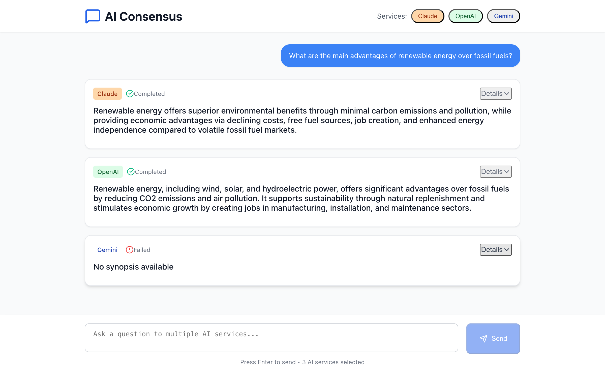
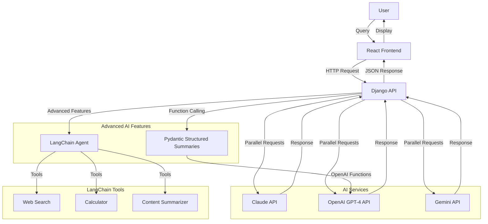

# AI Consensus 🤖✨

**Get informed answers by comparing responses from multiple AI services simultaneously**

## Why AI Consensus?

In today's AI-driven world, different AI models often provide varying perspectives on the same question. **AI Consensus** solves the problem of AI response uncertainty by letting you:

- **Compare multiple AI perspectives** side-by-side
- **Make informed decisions** based on consensus across leading AI services
- **Identify the most comprehensive answer** for your specific needs
- **Save time** by querying multiple AIs in parallel instead of switching between platforms

## The Problem This App Solves

### Before: The AI Shopping Problem
- 🔄 **Switching between platforms**: ChatGPT, Claude, Gemini separately  
- ❓ **Uncertain which AI gives the best answer** for your question
- ⏱️ **Time-consuming** to get multiple perspectives
- 🤔 **Hard to compare responses** when they're on different platforms

### After: AI Consensus Solution
- ⚡ **One query, three responses** - instantly compare Claude, GPT-4, and Gemini
- 📊 **Side-by-side comparison** with intelligent summaries and full details
- 🎯 **Choose the best response** and continue the conversation seamlessly  
- 🔧 **Advanced features** like LangChain agent orchestration and structured summaries

## Demo

**Sample Query**: "How will lower US interest rates affect USD to Euro conversion rate?"



*The app shows responses from Claude, OpenAI GPT-4, and Google Gemini side-by-side, with concise summaries and expandable details.*

## Key Features

### 🚀 Core Functionality
- **Multi-AI Query**: Simultaneous responses from Claude, GPT-4, and Gemini
- **Smart Summaries**: Concise overviews with expandable detailed responses
- **Response Selection**: Choose your preferred response and continue the conversation
- **Conversation Continuity**: Seamless chat experience with selected responses

### 🧠 Advanced AI Features
- **Pydantic-Based Intelligent Summaries**: Structured summarization using OpenAI function calling
- **LangChain Agent Orchestration**: Multi-tool agents with web search, calculator, and content summarizer
- **Enhanced API Endpoints**: `/summary/structured/` and `/agent/execute/` for specialized tasks
- **Flexible Agent Modes**: Standard chat, agent with tools, or structured summary mode

### 🛠️ Technical Features
- **Django REST API** backend with async AI service integration
- **React TypeScript** frontend with real-time updates
- **Modular AI Service Architecture** supporting easy addition of new AI providers
- **Comprehensive Error Handling** with fallback mechanisms
- **Authentication & Permissions** ready for multi-user deployment

## Architecture



## Tech Stack

- **Backend**: Django 4.2, Django REST Framework
- **Frontend**: React 18, TypeScript, Tailwind CSS
- **AI Integration**: OpenAI API, Anthropic Claude API, Google Gemini API
- **Advanced AI**: LangChain, Pydantic models for structured data
- **Database**: SQLite (development), PostgreSQL-ready
- **Deployment**: Docker-ready configuration

## Setup and Installation

### Prerequisites

- Python 3.9+
- Node.js 18+
- API Keys for:
  - OpenAI API (GPT-4 access required)
  - Anthropic Claude API
  - Google Gemini API

### Backend Setup

1. **Clone and navigate to project**
   ```bash
   git clone <repository-url>
   cd chat-ai-app
   ```

2. **Create virtual environment**
   ```bash
   python -m venv venv
   source venv/bin/activate  # On Windows: venv\Scripts\activate
   ```

3. **Install Python dependencies**
   ```bash
   pip install -r requirements.txt
   ```

4. **Configure environment variables**
   ```bash
   cp .env.example .env
   ```
   
   Edit `.env` with your API keys:
   ```env
   OPENAI_API_KEY=sk-your-openai-key
   CLAUDE_API_KEY=sk-ant-your-claude-key  
   GEMINI_API_KEY=your-gemini-key
   DJANGO_SECRET_KEY=your-secret-key
   DEBUG=True
   ```

5. **Run database migrations**
   ```bash
   python manage.py migrate
   ```

6. **Start Django server**
   ```bash
   python manage.py runserver 8001
   ```

### Frontend Setup

1. **Navigate to frontend directory**
   ```bash
   cd frontend/frontend
   ```

2. **Install Node.js dependencies**
   ```bash
   npm install
   ```

3. **Start React development server**
   ```bash
   npm start
   ```

### Access the Application

- **Frontend**: http://localhost:3000
- **Backend API**: http://localhost:8001
- **Demo Page**: http://localhost:8001/api/v1/demo/

## API Endpoints

### Core Endpoints
- `POST /api/v1/test-ai/` - Multi-AI query endpoint
- `POST /api/v1/conversations/` - Create conversation
- `GET /api/v1/conversations/` - List conversations

### Advanced AI Endpoints  
- `POST /api/v1/ai-services/summary/structured/` - Pydantic-based intelligent summaries
- `POST /api/v1/ai-services/agent/execute/` - LangChain agent execution
- `POST /api/v1/ai-services/agent/conversation/<id>/` - Agent conversation management

### Authentication
- `POST /api/v1/auth/register/` - User registration
- `POST /api/v1/auth/login/` - User login
- `POST /api/v1/auth/logout/` - User logout

## Usage Examples

### Basic Multi-AI Query
```bash
curl -X POST http://localhost:8001/api/v1/test-ai/ \
  -H "Content-Type: application/json" \
  -d '{"message": "Explain machine learning", "services": ["claude", "openai", "gemini"]}'
```

### Structured Summary
```bash
curl -X POST http://localhost:8001/api/v1/ai-services/summary/structured/ \
  -H "Content-Type: application/json" \
  -H "Authorization: Bearer <token>" \
  -d '{
    "content": "Your text to summarize",
    "ai_service": "openai",
    "use_enhanced": true
  }'
```

### LangChain Agent
```bash
curl -X POST http://localhost:8001/api/v1/ai-services/agent/execute/ \
  -H "Content-Type: application/json" \
  -H "Authorization: Bearer <token>" \  
  -d '{
    "query": "Calculate 25% of 400 and search for current weather",
    "tools": ["calculator", "web_search"],
    "ai_service": "openai"
  }'
```

## Development

### Running Tests
```bash
# Backend tests
python manage.py test

# Frontend tests  
cd frontend/frontend
npm test
```

### Code Quality
```bash
# Python linting
flake8 .
black .

# TypeScript checking
cd frontend/frontend
npm run type-check
```

## Contributing

1. Fork the repository
2. Create a feature branch (`git checkout -b feature/amazing-feature`)
3. Commit your changes (`git commit -m 'Add amazing feature'`)
4. Push to the branch (`git push origin feature/amazing-feature`)
5. Open a Pull Request

## License

This project is licensed under the MIT License - see the [LICENSE](LICENSE) file for details.

## Acknowledgments

- **OpenAI** for GPT-4 API
- **Anthropic** for Claude API  
- **Google** for Gemini API
- **LangChain** for agent orchestration framework
- **Django** and **React** communities for excellent frameworks