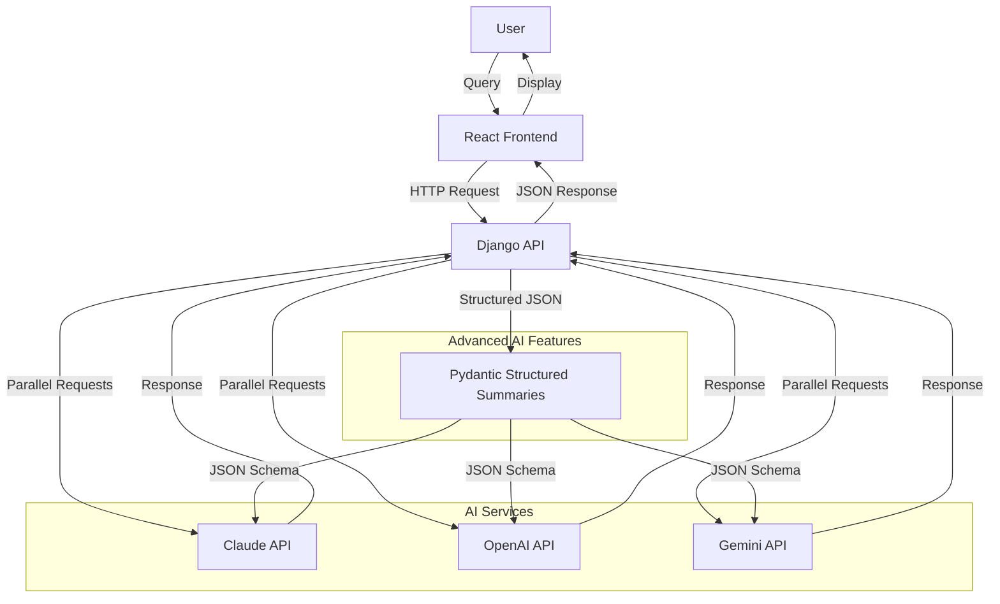

# AI Consensus 🤖✨

**Get informed answers by comparing responses from multiple AI services simultaneously**

## Why AI Consensus?

In today's AI-driven world, different AI models often provide varying perspectives on the same question. **AI Consensus** solves the problem of AI response uncertainty by letting you:

- **Compare multiple AI perspectives** side-by-side
- **Make informed decisions** based on consensus across leading AI services
- **Identify the most comprehensive answer** for your specific needs
- **Save time** by querying multiple AIs in parallel instead of switching between platforms

## The Problem This App Solves

### Before: The AI Shopping Problem
- 🔄 **Switching between platforms**: Multiple AI services separately  
- ❓ **Uncertain which AI gives the best answer** for your question
- ⏱️ **Time-consuming** to get multiple perspectives
- 🤔 **Hard to compare responses** when they're on different platforms

### After: AI Consensus Solution
- ⚡ **One query, multiple responses** - instantly compare responses from leading AI models
- 📊 **Side-by-side comparison** with AI-generated intelligent summaries and full details
- 🎯 **Choose the best response** and continue the conversation seamlessly  
- 🔧 **Advanced features** like structured summarization with each AI using its own intelligence

## Demo

**Sample Query 1**: "What are the main advantages of renewable energy over fossil fuels?"
**Sample Query 2**: "Which top three state-of-the-art LLMs are most frequently fine-tuned to support mission-critical business applications, with model weights either publicly accessible or available for licensing from leading frontier AI providers?"


*The app shows responses from multiple leading AI models side-by-side, with AI-generated intelligent summaries and expandable details.*

## Key Features

### 🚀 Core Functionality
- **Multi-AI Query**: Simultaneous responses from multiple leading AI models
- **AI-Generated Smart Summaries**: Each AI creates its own intelligent 35-45 word synopsis
- **Response Selection**: Choose your preferred response and continue the conversation
- **Conversation Continuity**: Seamless chat experience with selected responses
- **Real-time Visual Feedback**: Blinking animation while AIs are thinking, hover tooltips showing model information

### 🧠 Advanced AI Features
- **AI-Generated Smart Summaries**: Each AI creates its own intelligent 35-45 word synopsis
- **Pydantic-Based Structured Summaries**: Advanced structured summarization across all AI providers (OpenAI, Claude, Gemini)
- **Enhanced API Endpoints**: `/summary/structured/` for specialized tasks
- **Flexible Response Modes**: Standard chat or structured summary mode

### 🛠️ Technical Features
- **Django REST API** backend with async AI service integration
- **React TypeScript** frontend with real-time updates
- **Modular AI Service Architecture** supporting easy addition of new AI providers
- **Comprehensive Error Handling** with fallback mechanisms
- **Authentication & Permissions** ready for multi-user deployment

## Architecture



## Tech Stack

- **Backend**: Django 4.2.24, Django REST Framework 3.16.1
- **Frontend**: React 19, TypeScript, Tailwind CSS
- **AI Integration**: Multiple leading AI models and services
- **Advanced AI**: Pydantic 2.6.4, OpenAI 1.58.0
- **Database**: SQLite (development), PostgreSQL-ready
- **Deployment**: Docker-ready configuration

## Setup and Installation

### Prerequisites

- Python 3.9+
- Node.js 18+
- Redis (optional - for production caching; app works without it)
- API Keys for:
  - OpenAI API
  - Anthropic Claude API
  - Google Gemini API

### Backend Setup

1. **Clone and navigate to project**
   ```bash
   git clone <repository-url>
   cd chat-ai-app
   ```

2. **Create virtual environment**
   ```bash
   python3 -m venv venv
   source venv/bin/activate  # On Windows: venv\Scripts\activate
   ```

3. **Install Python dependencies**
   ```bash
   pip install --upgrade pip
   pip install -r requirements.txt
   ```

4. **Configure environment variables**
   ```bash
   cp .env.example .env
   ```
   
   Edit `.env` with your API keys:
   ```env
   # AI Service API Keys (get these from respective providers)
   OPENAI_API_KEY=sk-your-openai-key
   CLAUDE_API_KEY=sk-ant-your-claude-key  
   GEMINI_API_KEY=your-gemini-key
   
   # Django Configuration
   SECRET_KEY=your-secret-key-here
   DEBUG=True
   
   # Other settings are optional for basic setup
   ```

5. **Run database migrations (optional - only needed for user accounts and conversation history)**
   ```bash
   python3 manage.py migrate
   ```

6. **Start Django server**
   ```bash
   python3 manage.py runserver 8001
   ```

### Frontend Setup

1. **Navigate to frontend directory**
   ```bash
   cd frontend/frontend
   ```

2. **Install Node.js dependencies**
   ```bash
   npm install
   ```

3. **Start React development server**
   ```bash
   npm start
   ```

### Access the Application

- **Frontend**: http://localhost:3000
- **Backend API**: http://localhost:8001
- **Demo Page**: http://localhost:8001/api/v1/demo/

### Troubleshooting

**Common Issues:**

1. **Python command not found**: Use `python3` instead of `python` on Mac/Linux
2. **Port already in use**: Change the port number (e.g., `python3 manage.py runserver 8002`)
3. **API keys not working**: Ensure API keys are correctly set in `.env` file
4. **Frontend won't start**: 
   - Make sure you're in `frontend/frontend` directory
   - Run `npm install` again if needed
   - Security warnings are normal for development
5. **Redis connection errors**: App works without Redis - cache is configured to use dummy backend for development

**Required API Keys:**
- **OpenAI**: Get from https://platform.openai.com/api-keys
- **Claude**: Get from https://console.anthropic.com/
- **Gemini**: Get from https://ai.google.dev/

**Note**: The app will work with just one API key, but you'll get the best experience with all three.

## API Endpoints

### Core Endpoints
- `POST /api/v1/test-ai/` - Multi-AI query endpoint
- `POST /api/v1/conversations/` - Create conversation
- `GET /api/v1/conversations/` - List conversations

### Advanced AI Endpoints
- `POST /api/v1/ai-services/summary/structured/` - Pydantic-based intelligent summaries (supports OpenAI, Claude, Gemini)

### Authentication
- `POST /api/v1/auth/register/` - User registration
- `POST /api/v1/auth/login/` - User login
- `POST /api/v1/auth/logout/` - User logout

## Usage Examples

### Basic Multi-AI Query
```bash
curl -X POST http://localhost:8001/api/v1/test-ai/ \
  -H "Content-Type: application/json" \
  -d '{"message": "Explain machine learning", "services": ["claude", "openai", "gemini"]}'
```

### Structured Summary
```bash
curl -X POST http://localhost:8001/api/v1/ai-services/summary/structured/ \
  -H "Content-Type: application/json" \
  -H "Authorization: Bearer <token>" \
  -d '{
    "content": "Your text to summarize",
    "ai_service": "openai", // or "claude" or "gemini"
    "use_enhanced": true
  }'
```


## Development

### Running Tests
```bash
# Backend tests
python manage.py test

# Frontend tests  
cd frontend/frontend
npm test
```

### Code Quality
```bash
# Python linting
flake8 .
black .

# TypeScript checking
cd frontend/frontend
npm run type-check
```

## Contributing

1. Fork the repository
2. Create a feature branch (`git checkout -b feature/amazing-feature`)
3. Commit your changes (`git commit -m 'Add amazing feature'`)
4. Push to the branch (`git push origin feature/amazing-feature`)
5. Open a Pull Request

## License

This project is licensed under the MIT License - see the [LICENSE](LICENSE) file for details.

## Acknowledgments

- **OpenAI** for GPT API access
- **Anthropic** for Claude API access
- **Google** for Gemini API access
- **Django** and **React** communities for excellent frameworks