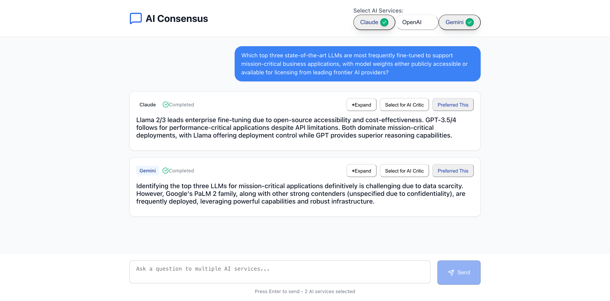
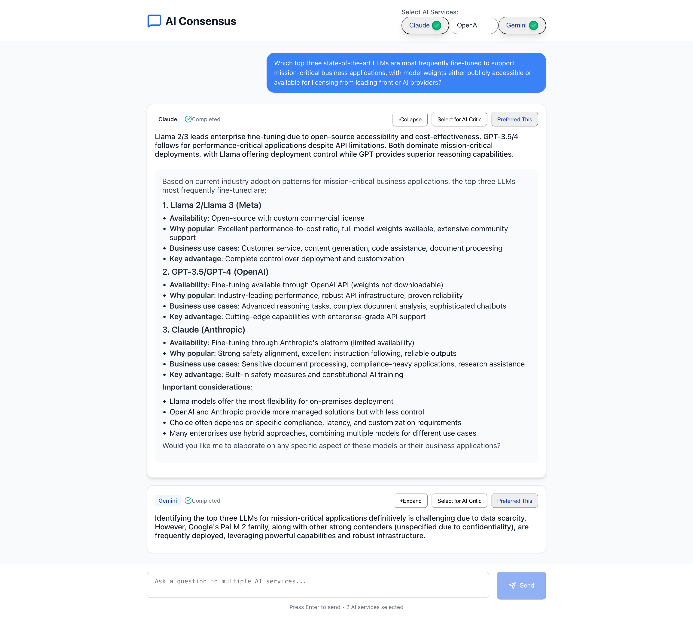
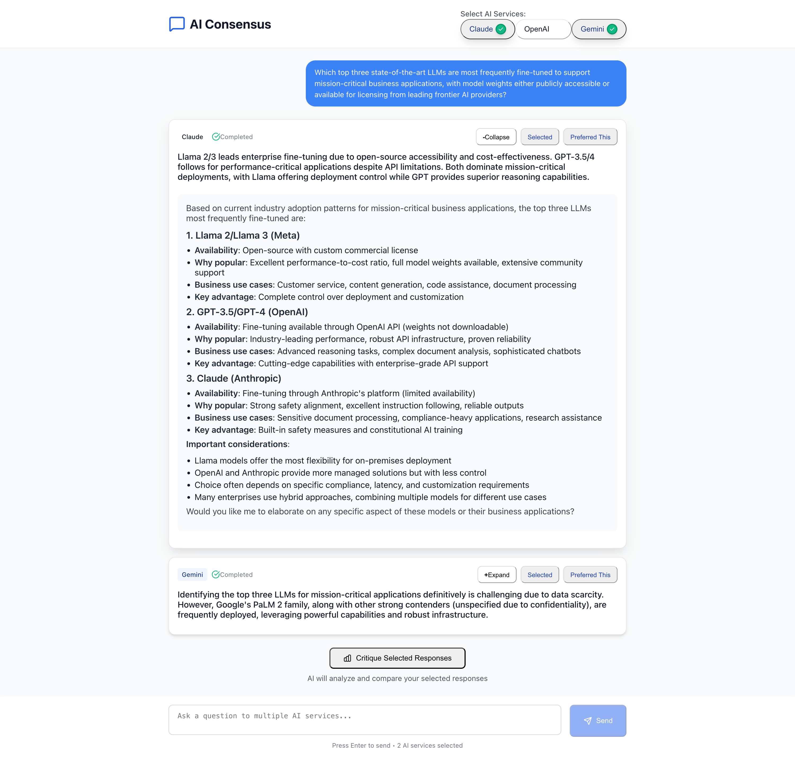
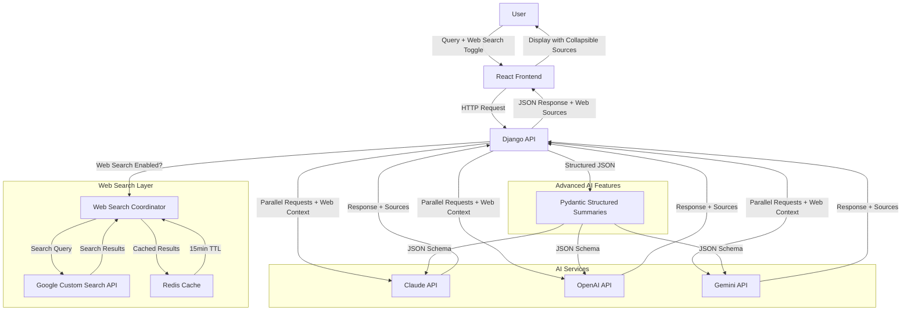

# AI Consensus 🤖✨

**Get informed answers by comparing responses from multiple AI services simultaneously**

## Why AI Consensus?

In today's AI-driven world, different AI models often provide varying perspectives on the same question. **AI Consensus** solves the problem of AI response uncertainty by letting you:

- **Compare multiple AI perspectives** side-by-side
- **Make informed decisions** based on consensus across leading AI services
- **Identify the most comprehensive answer** for your specific needs
- **Save time** by querying multiple AIs in parallel instead of switching between platforms

## The Problem This App Solves

### Before: The AI Shopping Problem
- 🔄 **Switching between platforms**: Multiple AI services separately  
- ❓ **Uncertain which AI gives the best answer** for your question
- ⏱️ **Time-consuming** to get multiple perspectives
- 🤔 **Hard to compare responses** when they're on different platforms

### After: AI Consensus Solution
- ⚡ **One query, multiple responses** - instantly compare responses from leading AI models
- 📊 **Side-by-side comparison** with AI-generated intelligent summaries and full details
- 🎯 **Choose the best response** and continue the conversation seamlessly  
- 🔧 **Advanced features** like structured summarization with each AI using its own intelligence

## Demo

**Sample Query**: "Which top three state-of-the-art LLMs are most frequently fine-tuned to support mission-critical business applications, with model weights either publicly accessible or available for licensing from leading frontier AI providers?"

### Clean Interface with Consistent Action Buttons


*Clean, modern interface with consistent action buttons: Expand/Collapse, Select for AI Critic, and Preferred This*

### Detailed Response View


*Expandable responses with full AI-generated content, structured markdown rendering, and action buttons*

### AI Critique & Comparison Feature


*Select multiple responses to get AI-powered comparative analysis and critique*

## Key Features

### 🚀 Core Functionality
- **Multi-AI Query**: Simultaneous responses from multiple leading AI models
- **AI-Generated Smart Summaries**: Each AI creates its own intelligent 35-45 word synopsis
- **Web Search Integration**: Optional real-time web search to enhance AI responses with up-to-date information
- **Response Selection**: Choose your preferred response and continue the conversation
- **Conversation Continuity**: Seamless chat experience with selected responses
- **Real-time Visual Feedback**: Blinking animation while AIs are thinking, hover tooltips showing model information

### 🧠 Advanced AI Features
- **AI-Generated Smart Summaries**: Each AI creates its own intelligent 35-45 word synopsis
- **AI Critique & Comparison**: Select any two responses for detailed AI-powered comparative analysis
- **Structured Summaries**: Advanced structured summarization across all AI providers
- **Enhanced API Endpoints**: `/summary/structured/` and `/critique/compare/` for specialized tasks
- **Flexible Response Modes**: Standard chat or structured summary mode

### 🎨 UI/UX Improvements
- **Consistent Action Buttons**: Uniform styling across Expand/Collapse, Select for AI Critic, and Preferred This buttons
- **Intelligent Response Selection**: "Preferred This" removes all other responses including AI Critic for clean continuation
- **No Auto-Expansion**: Select for AI Critic doesn't automatically expand responses, giving users full control
- **Professional Button Design**: Consistent height, padding, and visual weight across all interactive elements

### 🌐 Web Search Features
- **Real-time Web Search**: Toggle-enabled Google Custom Search integration for current information
- **Intelligent Search Orchestration**: Automatic recency detection and smart query optimization
- **Rate Limiting**: 2 search calls per user query with proper rate limiting per user
- **Caching Layer**: 15-minute Redis TTL for efficient search result caching
- **Source Display**: Collapsible web sources with clickable links (collapsed by default)
- **Context Enhancement**: Web search results seamlessly integrated into AI prompts

### 🛠️ Technical Features
- **REST API** backend with async AI service integration
- **Modern web frontend** with real-time updates
- **Modular AI Service Architecture** supporting easy addition of new AI providers
- **Comprehensive Error Handling** with fallback mechanisms
- **Authentication & Permissions** ready for multi-user deployment

## Architecture




## Setup and Installation

### Prerequisites

- Modern Python environment
- Current Node.js runtime
- Optional caching service (for production; app works without it)
- API Keys for supported AI services

### Backend Setup

1. **Clone and navigate to project**
   ```bash
   git clone <repository-url>
   cd chat-ai-app
   ```

2. **Create virtual environment**
   ```bash
   python3 -m venv venv
   source venv/bin/activate  # On Windows: venv\Scripts\activate
   ```

3. **Install dependencies**
   ```bash
   pip install --upgrade pip
   pip install -r requirements.txt
   ```

4. **Configure environment variables**
   ```bash
   cp .env.example .env
   ```
   
   Edit `.env` with your API keys:
   ```env
   # AI Service API Keys (get these from respective providers)
   OPENAI_API_KEY=sk-your-openai-key
   CLAUDE_API_KEY=sk-ant-your-claude-key
   GEMINI_API_KEY=your-gemini-key

   # Google Custom Search API (for web search functionality)
   GOOGLE_CSE_API_KEY=your-google-custom-search-api-key
   GOOGLE_CSE_CX=your-custom-search-engine-id

   # Django Configuration
   SECRET_KEY=your-secret-key-here
   DEBUG=True

   # Other settings are optional for basic setup
   ```

5. **Run database migrations (optional - only needed for user accounts and conversation history)**
   ```bash
   python3 manage.py migrate
   ```

6. **Start backend server**
   ```bash
   python3 manage.py runserver 8000
   ```

### Frontend Setup

1. **Navigate to frontend directory**
   ```bash
   cd frontend/frontend
   ```

2. **Install dependencies**
   ```bash
   npm install
   ```

   **Note**: The project includes modern dependencies like React 19, TailwindCSS 3.x with PostCSS plugin, and TypeScript.

3. **Start frontend development server**
   ```bash
   npm start
   ```

### Access the Application

- **Frontend**: http://localhost:3000
- **Backend API**: http://localhost:8001
- **Demo Page**: http://localhost:8001/api/v1/demo/

### Troubleshooting

**Common Issues:**

1. **Python command not found**: Use `python3` instead of `python` on Mac/Linux
2. **Port already in use**: Change the port number (e.g., `python3 manage.py runserver 8002`)
3. **API keys not working**: Ensure API keys are correctly set in `.env` file
4. **Frontend won't start**:
   - Make sure you're in `frontend/frontend` directory
   - Run `npm install` again if needed
   - Security warnings are normal for development
   - For TailwindCSS compilation errors, ensure `@tailwindcss/postcss` is installed
5. **Redis connection errors**: App works without Redis - cache is configured to use dummy backend for development

**Required API Keys:**
- **OpenAI**: Get from https://platform.openai.com/api-keys
- **Claude**: Get from https://console.anthropic.com/
- **Gemini**: Get from https://ai.google.dev/
- **Google Custom Search**: Get API key from https://developers.google.com/custom-search/v1/introduction and create Custom Search Engine at https://programmablesearchengine.google.com/

**Note**: The app will work with just one AI API key, but you'll get the best experience with all three. Google Custom Search API is optional but enables web search functionality.

## API Endpoints

### Core Endpoints
- `POST /api/v1/test-ai/` - Multi-AI query endpoint (supports web search via `use_web_search` parameter)
- `POST /api/v1/conversations/` - Create conversation
- `GET /api/v1/conversations/` - List conversations

### Advanced AI Endpoints
- `POST /api/v1/ai-services/summary/structured/` - Structured intelligent summaries
- `POST /api/v1/critique/compare/` - AI-powered response comparison and critique

### Authentication
- `POST /api/v1/auth/register/` - User registration
- `POST /api/v1/auth/login/` - User login
- `POST /api/v1/auth/logout/` - User logout

## Usage Examples

### Basic Multi-AI Query
```bash
curl -X POST http://localhost:8001/api/v1/test-ai/ \
  -H "Content-Type: application/json" \
  -d '{"message": "Explain machine learning", "services": ["claude", "openai", "gemini"]}'
```

### Multi-AI Query with Web Search
```bash
curl -X POST http://localhost:8001/api/v1/test-ai/ \
  -H "Content-Type: application/json" \
  -d '{
    "message": "What are the latest developments in AI safety research?",
    "services": ["claude", "openai", "gemini"],
    "use_web_search": true
  }'
```

### Structured Summary
```bash
curl -X POST http://localhost:8001/api/v1/ai-services/summary/structured/ \
  -H "Content-Type: application/json" \
  -H "Authorization: Bearer <token>" \
  -d '{
    "content": "Your text to summarize",
    "ai_service": "openai", // or "claude" or "gemini"
    "use_enhanced": true
  }'
```

### AI Critique & Comparison
```bash
curl -X POST http://localhost:8001/api/v1/critique/compare/ \
  -H "Content-Type: application/json" \
  -d '{
    "user_query": "Your original question",
    "llm1_name": "Claude",
    "llm1_response": "First AI response to compare",
    "llm2_name": "Gemini",
    "llm2_response": "Second AI response to compare",
    "chat_history": "Previous conversation context"
  }'
```


## Development

### Running Tests
```bash
# Backend tests
python manage.py test

# Frontend tests  
cd frontend/frontend
npm test
```

### Code Quality
```bash
# Backend linting
flake8 .
black .

# Frontend type checking
cd frontend/frontend
npm run type-check
```

## Contributing

1. Fork the repository
2. Create a feature branch (`git checkout -b feature/amazing-feature`)
3. Commit your changes (`git commit -m 'Add amazing feature'`)
4. Push to the branch (`git push origin feature/amazing-feature`)
5. Open a Pull Request

## License

This project is licensed under the MIT License - see the [LICENSE](LICENSE) file for details.

## Acknowledgments

- **OpenAI** for API access
- **Anthropic** for API access
- **Google** for API access
- Open source communities for excellent frameworks and tools